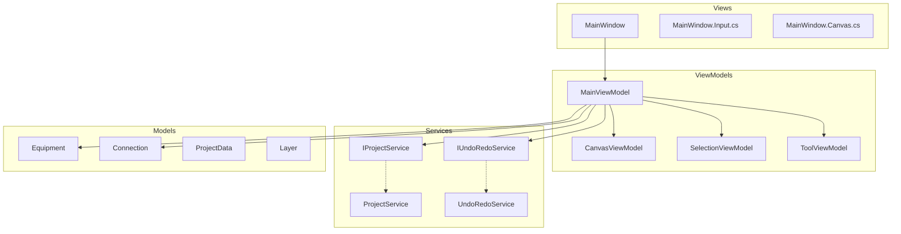
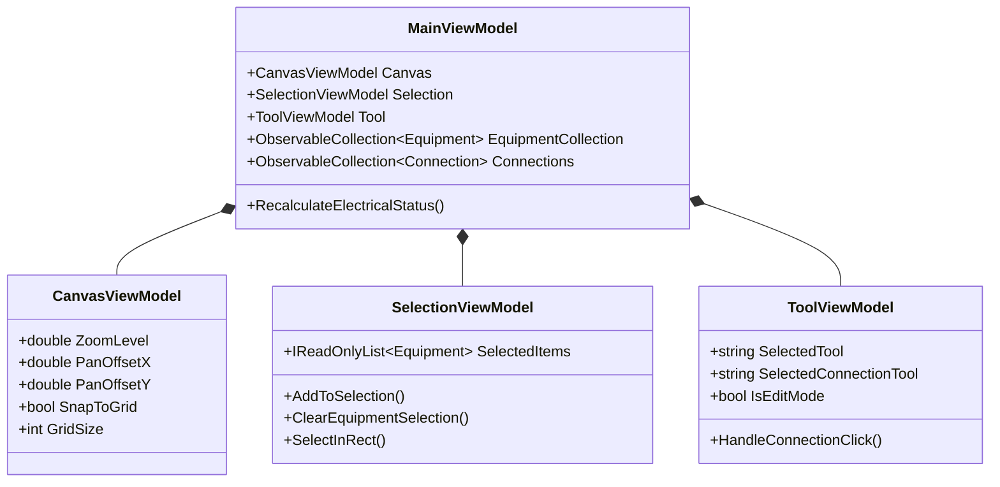
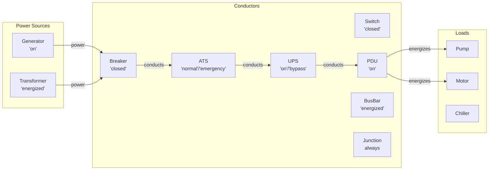

# Adjutant - Equipment Status Tracker

A WPF application for tracking and visualizing equipment status in data centers, mechanical rooms, and industrial facilities. Built with .NET 8 and MVVM architecture.

## Features

- Visual canvas for equipment layout with pan/zoom
- Equipment types: Valves, Breakers, Pumps, Generators, Transformers, UPS, ATS, and more
- Electrical and pipe connections with power flow visualization
- Real-time status tracking (Normal/Abnormal/Warning)
- LOTO (Lock Out Tag Out) support
- Undo/Redo functionality
- Layer management
- CSV export for equipment status and history
- Auto-save

## Architecture



## ViewModel Composition



## Electrical Power Flow

Power propagates from sources (Generators, Transformers) through conducting equipment:



## Building

```bash
# Build
dotnet build

# Run tests
dotnet test

# Publish self-contained executable
dotnet publish EquipmentStatusTracker.WPF.csproj -c Release -r win-x64 --self-contained true -p:PublishSingleFile=true -o ./publish
```

## Requirements

- Windows 10 or later (64-bit)
- No .NET installation required for published executable

## License

MIT
